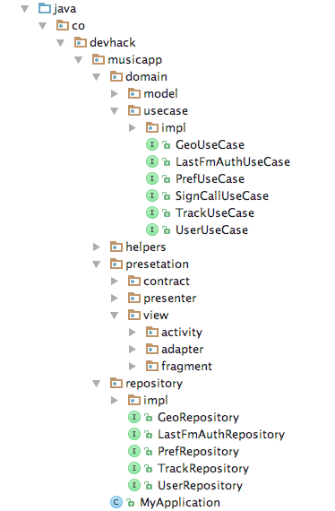

# Estructura de paquetes de Clean Arquitecture

## Descripción de paquetes:

* **domain:** Paquete que agrupa las clases que representan el nucleo de la aplicación
    * **model:** Clases planas (POJO) que almacenaran la informacion con la que trabajan los Respositories y UseCases
    * **usecase:** Interfaces que definen el comportamiento de los casos de uso
        * **impl:** Clases concretas donde se implementa la logica de negocio definida en la interface
    * **helpers:** Clases de ayuda que contienen metodos que pueden ser usadas en varias partes de la aplicación
    * **presentation:** Paquete donde se agrupa todo lo relacionado con la capa de presentacion (Vistas, Presentadores y Contratos)
        * **contract:** Interfaces donde se define el funciomaiento de las vitas y presentadores
        * **presenter:** Clases encargaas de la logica de presentacion y manipulacion de las vistas
        * **view:** Paquete que agrupa los diferentes tipos de vistas que se usan en Android
            * **activity:** Clases (vistas) que extienden de Activity, AppCompactActivity, etc.
            * **adapter:** Clases que extienden de algun tipo de adapter como RecylerView.Adapter, BaseAdapter, etc.
            * **fragment:** Clases (vistas) que extienden de Fragment, ListFragment, etc.
        * **repository:** Interfaces que definen el comportamiento de la capa de acceso a datos
            * **impl:** Clases concrestas donde se implementa el mecanimos de obtencion de datos. Ej: Api Rest, SQLite, Memoria, Archivos

